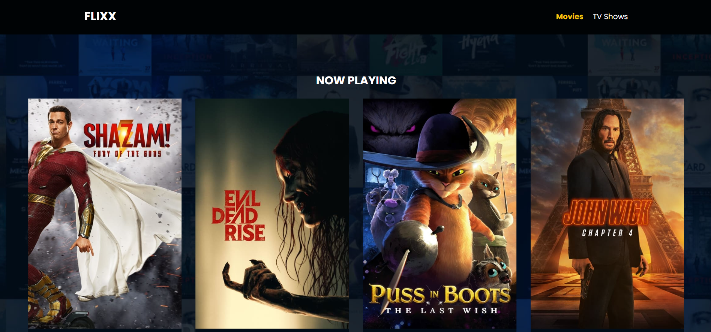
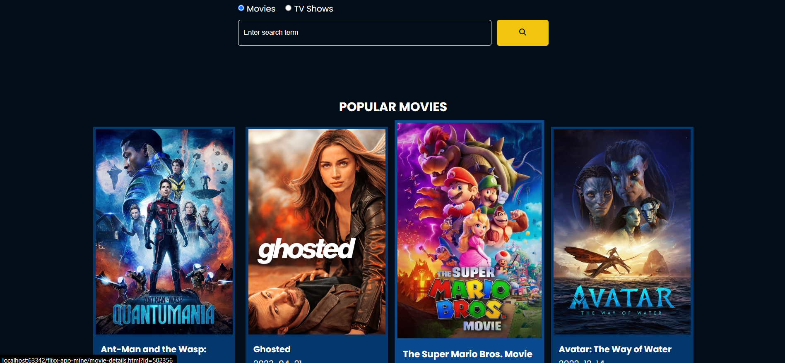
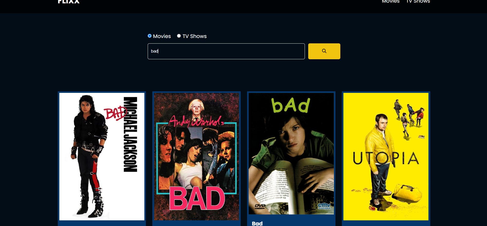
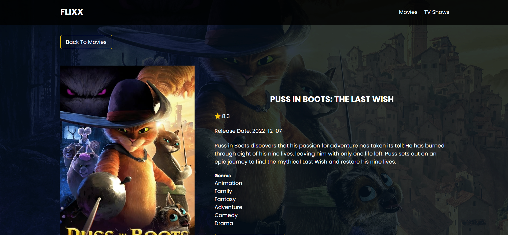
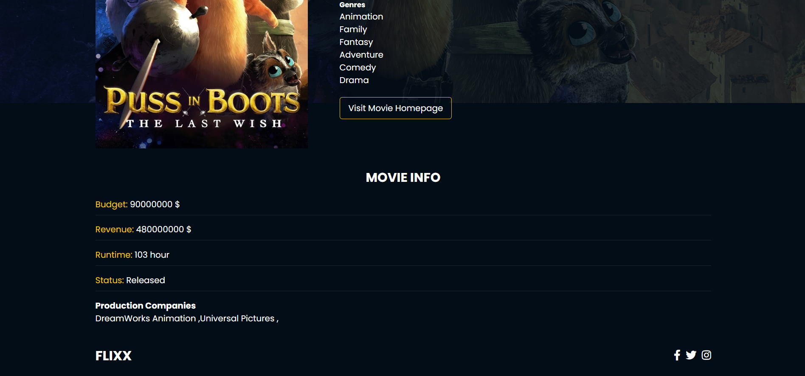
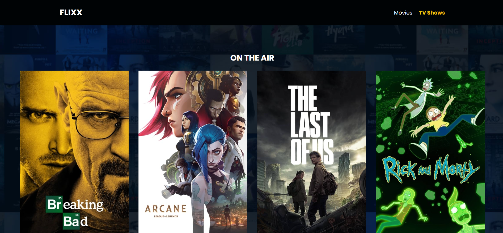
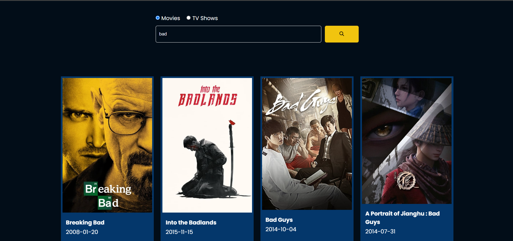
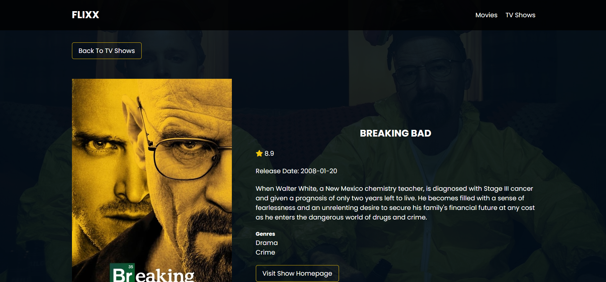

# movie-site
simple movie site with vanilla JS and a rest api
:movie_camera:
:clapper:

___

this simple site for movies, tv shows, ratings and ext... using a popular movie api
#### movie api which is a full rest api:
https://developers.themoviedb.org/3

site's address is available in the description of project

*it probably would not work without vpn :unamused: !

___
___

# some pictures of app:
## main page | movies page

### search in movies page

### each movie details

## tvshows

### search in tv shows

### tv show details

